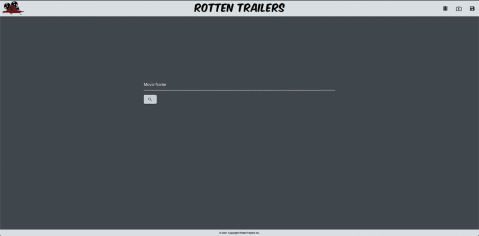

# Rotten_Trailers

RottenTrailers is an application lets you search for a movie, see the IMDB rating, watch the movie’s trailer, and even save it to watch later. The application uses 3 APIs to deliver reviews and trailers at your finger tips. As a user you can watch it now or save them for a list later down the road.

## GitHub Links

Live Page [Link](https://jeffcela.github.io/Rotten_Trailers/index.html)  
Project Repository [Link](https://github.com/jeffcela/Rotten_Trailers)  
Presentation [Link](https://docs.google.com/presentation/d/149NPgtjJDJShj_GTdnjFl7rccR3gCfgJ32iG5gs2f9Y/edit?usp=sharing)

## How its made!

Make sure to clone or download the entire repository as this document uses **HTML, CSS, Images, and JavaScript files**. If you add in any additional features, please comment where you added them to make it easier for other developers to follow, you will see that comments have been left for future upgrades or tinkering.

Each of the APIs that are being called upon have specifc documentation, please read carefully before making changes as you can cause a break in the scripts.

**What is included:**

- index.html
- search.html
- saved.html
- tv.html
- 404.html
- gitignore (Used to prevent items from being added to the repo)
- assets folder
  - images
    - rotten_trailers_favicon.png
    - rotten_trailers_logo-type.png
    - rotten_trailers_logo.jpg
    - rotten_trailers_logo.png
    - rotten_trailers_logo_NT.png
    - rotten_trailers_logo_hor.png
    - rotten_trailers_logo_hor_white.png
    - rotten_trailers_logo_sbs.png
  - css folder
    - style.css
    - reset.css
  - js folder
    - script.js
    - search.js
    - video.js
- README.md

_Please make sure that you are adding any additional assets as needed_

## Welcome to RottenTrailers, here is a sneak preview of what to expect!

# Credit 

_This homework assignment was completed in VS Code and Terminal/GitBash by [Katsunori Matsushita](https://www.linkedin.com/in/katsunori-matsushita-84928b90/), Pia Trivedi, [Hannah Lewis](https://www.linkedin.com/in/hannah-lewis-253841145/), [Jeff Cela](https://www.linkedin.com/in/jeffcela/) from 08/03/2021-08/10/2021_ 

© 2021 Trilogy Education Services, LLC, a 2U, Inc. brand. Confidential and Proprietary. All Rights Reserved. 
_HTML._ W3Schools Online Web Tutorials. (1999). [https://www.w3schools.com/](https://www.w3schools.com/). 
Google. (n.d.). _YouTube data API_ | _Google developers._ Google. https://developers.google.com/youtube/v3. 
Google. (n.d.). _Youtube player api reference for iframe embeds._ Google. https://developers.google.com/youtube/iframe_api_reference. 
_API hub - free public &amp; Open rest apis._ RapidAPI. (n.d.). https://rapidapi.com/hub.
